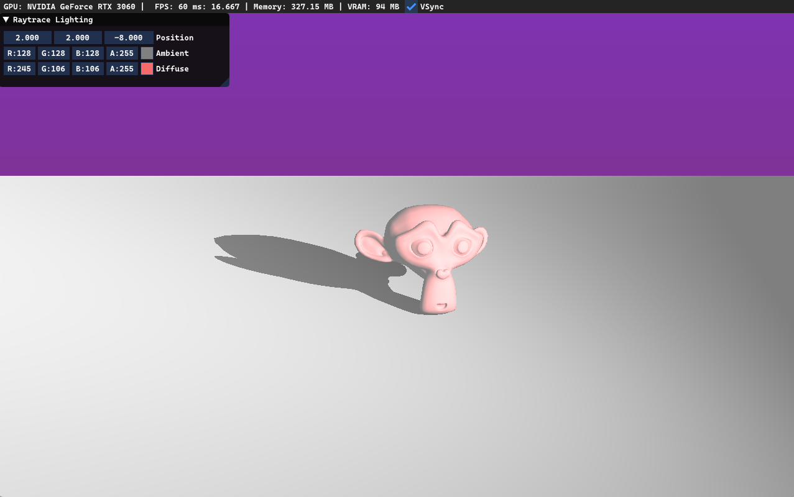

# DXR Demo
###
Demo done for learning DirectX Raytracing purposes

Built with:
<ul>
<li>C++ 20</li>
<li>Visual Studio 2022: MSVC, MSBuild, Windows SDK, Win32 API</li>
<li>DirectX 12 with DXR</li>
</ul>

Third-party:
- [DirectXTex](https://github.com/microsoft/DirectXTex)
- [DirectXTK12](https://github.com/microsoft/DirectXTK12) -> WIC/DDS loaders
- [imgui](https://github.com/ocornut/imgui)
- [assimp](https://github.com/assimp/assimp)
  
DLLs to compile and serialize HLSL model 6.x shaders are provided alongside Post-Build copy event 
 
Controls: 
Hold RMB to control camera rotation  
WSAD - to move 
Q - camera down, E - camera up 
R - reset camera position and rotation 
Esc - exit 
###

