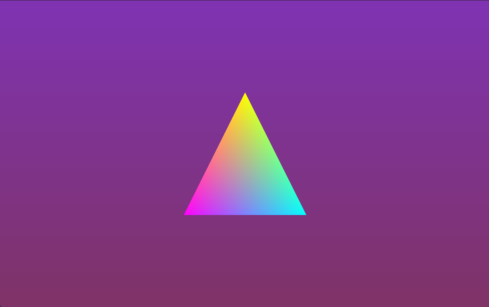

# DXR Demo
###
Demo done for learning DirectX Raytracing purposes

Built with:
C++ 20,
Visual Studio 2022,
DirectX 12 with DXR
  
DLLs to create and serialize HLSL model 6.x shaders are provided with Post-Build copy event

Controls: 
Hold RMB to control camera rotation  
WSAD - to move 
Q - camera down, E - camera up 
R - reset camera position and rotation 
Esc - exit 

###

