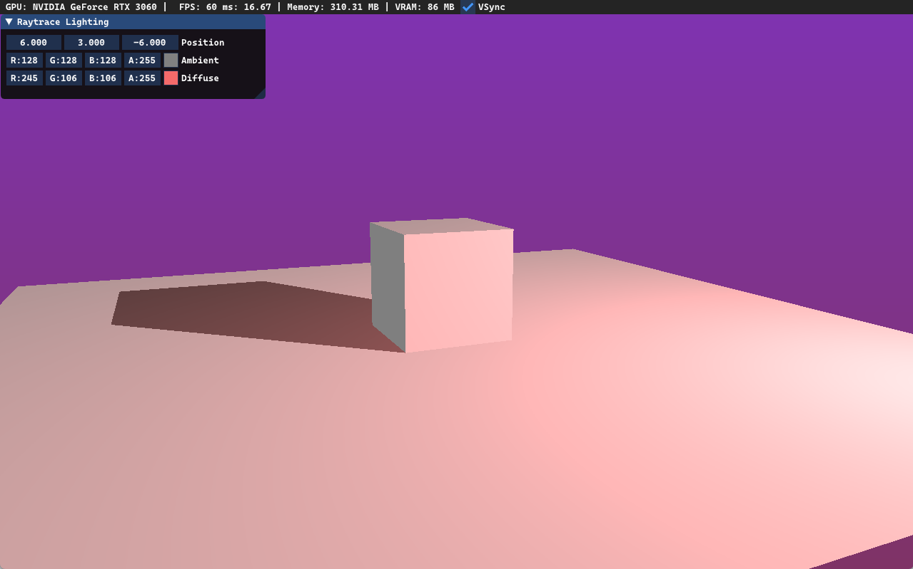

# DXR Demo
###
Demo done for learning DirectX Raytracing purposes

Built with:
<ul>
<li>C++ 20</li>
<li>Visual Studio 2022 - MSVC, Windows SDK, Win3 API</li>
<li>DirectX 12 with DXR</li>
</ul>
DLLs to create and serialize HLSL model 6.x shaders are provided alongside Post-Build copy event 
 
Controls: 
Hold RMB to control camera rotation  
WSAD - to move 
Q - camera down, E - camera up 
R - reset camera position and rotation 
Esc - exit 

###

